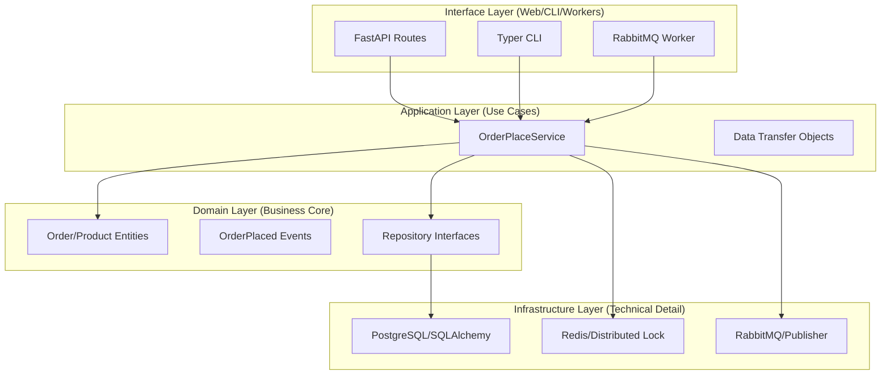

# 🎓 Clean Architecture & DDD Knowledge Map (Python)

**Mission / Sứ mệnh**: Dự án này là một cỗ máy hoàn chỉnh được thiết kế để học tập và triển khai Microservices chuyên nghiệp, tuân thủ nguyên tắc **Clean Architecture** và **Domain-Driven Design (DDD)**. / This project is a complete engine designed for learning and building professional Microservices, adhering to **Clean Architecture** and **Domain-Driven Design (DDD)**.

Tiếng Việt | [English](#-english-version)

---

## 🇻🇳 Tiếng Việt

### 🏛️ Sơ đồ Kiến trúc (Architecture Map)

### 📄 Bối cảnh & Tư duy (Context & Why)
- **Context**: Tại sao phải phức tạp như vậy? Trong các hệ thống lớn, việc thay đổi Database hay API framework là chuyện thường ngày. Nếu code nghiệp vụ bị trộn lẫn, hệ thống sẽ sụp đổ khi thay đổi.
- **Constraints**: 
    1. **Dependency Rule**: Tầng bên trong không bao giờ được biết về tầng bên ngoài.
    2. **Pure Domain**: Domain không được chứa bất kỳ mã IO hay framework nào (không SQLAlchemy, không FastAPI).

### 🚀 Điểm nhấn Kỹ thuật (Engineering Highlights)
- **PII Masking**: Tự động che giấu dữ liệu nhạy cảm (Email, ID) trong logs hệ thống.
- **Circuit Breaker**: Bảo vệ hệ thống khi dịch vụ thanh toán bên ngoài (Stripe) gặp sự cố.
- **Async Efficiency**: Toàn bộ luồng từ API -> Service -> DB đều chạy Bất đồng bộ (Async).

### 📖 Hướng dẫn Mở rộng (Scaling Guide)
Xem chi tiết tại: [EXTENSIBILITY.md](file:///home/korosaki-ryukai/Workspace/Service/base_service/docs/EXTENSIBILITY.md)

---

## 🇺🇸 English Version

### 🏛️ Architecture Map
(See Mermaid diagram above)

### 📄 Context & Constraints
- **Context**: Why this complexity? In enterprise systems, switching databases or API frameworks is common. If business logic is entangled with tech, the system breaks during transitions.
- **Constraints**: 
    1. **Dependency Rule**: Inner layers never depend on outer layers.
    2. **Pure Domain**: The Domain must remain free of IO or framework libraries (no SQLAlchemy, no FastAPI).

### 🚀 Engineering Highlights
- **PII Masking**: Automatically redacts sensitive data (Emails, IDs) in system logs.
- **Circuit Breaker**: Protects system stability when external services (Stripe) fail.
- **Async Efficiency**: Pure async flow across API, Services, and Infrastructure.

### 📖 Extensibility Guide
Read more: [EXTENSIBILITY.md](file:///home/korosaki-ryukai/Workspace/Service/base_service/docs/EXTENSIBILITY.md)
